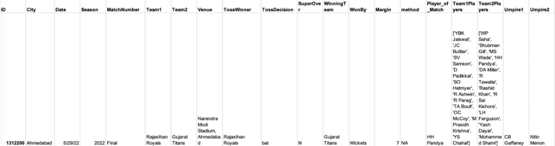

# Introduction

Cricket is the most popular sport in the Indian subcontinent and the annual Indian Premier League (IPL) is one of its key events. Sports analysis remains a lucrative domain for professionals and hobbyists alike, evident in studies employing various ML methods across many sports tournaments with similar formats \[1\], \[2\].

Barot et al \[3\] analyze 4 years of IPL data to create a model that can predict the outcome of matches. The features extracted are team performance, location (home/away) and other external factors affecting a match. Another study \[1\] performs a binary classification to predict whether a team will make the NBA playoffs based on the performance in the regular season, using 25 years of match statistics.

# Problem Definition

The goals of this project are two-fold: 
* Firstly, we propose to **predict the likelihood of teams qualifying for the IPL playoffs**. We plan to train a supervised learning model, with the most discriminative features extracted from the dataset, to predict chances of each team advancing to the IPL playoffs. 
* Secondly, we propose to **group players in various contract categories based on their performance**. There are five possible player contract categories (Grade-A+, Grade-A, Grade-B, Grade-C, Non-Contracted), which directly influences the players bidding amount.  We propose to use an unsupervised clustering algorithm to tackle this problem.

# Data Collection

The data was sourced from: 
[Kaggle dataset for IPL from 2008-2022](https://www.kaggle.com/datasets/vora1011/ipl-2008-to-2021-all-match-dataset)
This dataset provides the match data of every single match played in IPL so far, covering the years 2008-2022. The data consists of mostly string values - here is an example row:

## Data description
Here is a description of the features and their relevance. The focus of this description is for our supervised learning task of predicting playoff teams.

1. `ID`: This is a unique match identifier. We do not use this in our project.
2. `City`, `Date` and `Season` of the match played
3. `MatchNumber`: This feature can range from 1-72 or have a value from the list ["Final", "Qualifier", "Qualifier 1", "Qualifier 2", "Eliminator", "Semi Final", "Elimination Final", "3rd Place Play-Off”] Group stage matches are the numbered ones, and the ones from the list are matches in the playoffs/knockout stages. Since we predict playoff qualification based on regular season performance, we only use the rows that have a numeric value for this feature
4. `Team1`, `Team2`: Team names of playing teams
5. `Venue`: Stadium where the match was played. The pitch properties of a venue may favor playing styles of some teams
6. `TossWinner`: Can be equal to Team1 or Team2 - the team that won the toss
7. `TossDecision`: Can be either ‘bat’ or ‘field’ - the decision made by the team that won the Toss
8. `SuperOver`: A special over played when the teams are tied. This feature is a boolean value indicating whether the match was decided in a tie breaking over
9. `WinningTeam`: The team that won - this is the label for our data
10. `WonBy`: Can be either ‘Wickets’ or ‘Runs’ based on how the winning team won the match 
11. `Margin`: Complements ‘WonBy’ - the numeric value corresponds to the winning margin. If ‘WonBy’ == ‘Runs’ and ‘Margin’ == 10, the WinningTeam won by 10 runs 
12. `Method`: Whether D/L (Duckworth-Lewis) was applied in case of cutting the match short due to inclement weather 
13. `Player_of_Match`: The player who won the player of the match award for good performance
14. `Team1Players`, `Team2Players`: The playing 11 squad in the match - a team typically consists of more than 11 players, so this value may differ for a team across matches
15. `Umpire1`, `Umpire2`: The names of the Umpires for the match

In addition to the features available from the Kaggle dataset, we construct 2 new features:
1. `Team1Mean`: Mean ‘Rating’ of the players in the ‘Team1Players’ feature value for this match
2. `Team2Mean`: Mean ‘Rating’ of the players in the ‘Team2Players’ feature value for this match

‘Rating’ here is sourced from [ICC Cricket data](https://www.icc-cricket.com/rankings/mens/player-rankings/t20i). We choose the T20I rating since the IPL is a T20 format tournament (20 overs in a match). 

More specifically, all unique player names are extracted from the primary dataset, and the latest T20 rating is then used if available. The ICC may not provide a rating for players who have played very few international matches, or if some prolific senior players only played the first couple of IPL seasons when the T20 format was fairly new. 

# Methods for Data Pre-processing

### Data cleaning

1. Team Name Changes

Over the last 15 seasons of the IPL, if a team was renamed, we have chosen the latest team name throughout all seasons to preserve the history of stats.

Image Source: [Wikipedia](https://en.wikipedia.org/wiki/Indian_Premier_League#Teams)

- Delhi Daredevils renamed to Delhi Capitals across all seasons
- Kings Xi Punjab renamed to Punjab Kings across all seasons
- Deccan Chargers renamed to Sunrisers Hyderabad to account for the franchise change 

Additionally, typos in team names were fixed to keep names consistent.

2. Categorical Values 

Wherever possible, string values have been encoded into categorical values. This is useful when we use the chi-square test for feature selection. For example, there are 11 total cities where all the IPL matches have ever been played. The feature values for ‘City’ i.e. ‘Bangalore’, ‘Chennai’, ‘Delhi’ etc. are encoded as 0, 1, .. ,10

3. Missing Values 

- Missing ‘City’ values were populated based on the ‘Venue’ values. For example, the Venue Sharjah Cricket Stadium’ is in City ‘Sharjah’.
- Missing ‘Rating’ values for players were imputed using the average player rating across all players to minimize bias
- Rows corresponding to incomplete/cancelled matches were dropped to remove complexity

4. Extra Features 

The names of the playing squads of both teams did not seem intuitively useful by themselves. Mean ratings of the playing 11 for both teams i.e. ‘Team1Mean’ and ‘Team2Mean’ are added to the dataset

5. Binarize Labels

Since ‘WinningTeam’ is either Team1’s name or Team2’s name, after converting to categorical data, the values are in the range 0-14. To binarize, the value of the label ‘WinningTeam’ is converted to 0 if it is equal to Team1’s value or 1 if it is equal to Team2’s value. This makes the classification task simpler.

### Dimensionality Reduction

Since the features do not have continuous numerical values, the chi-square analysis with p-values was used to select the best features instead of PCA. The p-values for each feature were plotted, and the features with the highest p-value were discarded. Traditionally, a threshold of p <= 0.05 is used in the chi-square analysis. It is statistically concluded that features with a p-value greater than 0.05 do not affect the target variable (label) and thus can be dropped. Since each season had a slightly varying list of features that could be dropped, only the ones common to all seasons were picked. This was because the intention was to train all seasons (except the latest one which is test data) together.

Based on this analysis, the features dropped were ‘WonBy’ and ‘TossDecision’. As described in the data collection section, since ‘Margin’ depends on ‘WonBy’, it was also dropped. P-value plots from some seasons:

The correlation matrix after cleaning and dimensionality reduction isn’t exactly ideal. We will attempt PCA with modifications for discrete values or backward feature selection for another dimensionality reduction strategy.

### Supervised Learning Task
The strategy employed for training classifiers is as follows:
1. Use training data from seasons 2008-2021 for training and 2022 for testing
2. Train a list of classifiers, and predict the outcome of each match in the 2022 season
3. Based on the results, rank each team in based on the match outcomes 
4. Observe if the top 4 ranked teams are the ones who made it into the playoffs 

Since the success of the classifiers cannot be mapped directly to the strategy of getting the top-ranked teams, the ML metrics are measured one step earlier, i.e. whether the match outcomes were predicted correctly. This is the focus of the results and evaluation at this point.

# Results
### Supervised Learning Task

### Unsupervised Learning Task
We plan to use K-means/GMM/DBScan to cluster players based on performance for predicting the contract category that is likely to be offered to them. 

# References

1. Ma, Nigel. "NBA Playoff Prediction Using Several Machine Learning Methods." 2021 3rd International Conference on Machine Learning, Big Data and Business Intelligence (MLBDBI). IEEE, 2021.
2. Yaseen, Aliaa Saad, Ali Fadhil Marhoon, and Sarmad Asaad Saleem. "Multimodal Machine Learning for Major League Baseball Playoff Prediction." Informatica 46.6 (2022).
3. H. Barot, A. Kothari, P. Bide, B. Ahir and R. Kankaria, "Analysis and Prediction for the Indian Premier League," 2020 International Conference for Emerging Technology (INCET), 2020, pp. 1-7, doi: 10.1109/INCET49848.2020.9153972.
4. Garg, M (2016). Indian Premier League (Cricket), Version 5. Retrieved October 5, 2022 from [https://www.kaggle.com/datasets/manasgarg/ipl](https://www.kaggle.com/datasets/manasgarg/ipl) 
5. [https://www.kaggle.com/datasets/vora1011/ipl-2008-to-2021-all-match-dataset](https://www.kaggle.com/datasets/vora1011/ipl-2008-to-2021-all-match-dataset)
6. Vora, S (2022). IPL 2008 to 2022 All Match Dataset, Version 3. Retrieved October 5, 2022 from [https://www.kaggle.com/datasets/vora1011/ipl-2008-to-2021-all-match-dataset](https://www.kaggle.com/datasets/vora1011/ipl-2008-to-2021-all-match-dataset) 
7. A. Santra, A. Sinha, P. Saha and A. K. Das, "A Novel Regression based Technique for Batsman Evaluation in the Indian Premier League," 2020 IEEE 1st International Conference for Convergence in Engineering (ICCE), 2020, pp. 379-384, doi: 10.1109/ICCE50343.2020.9290569.

# Timeline

[Proposal Gantt Chart](https://gtvault-my.sharepoint.com/:x:/g/personal/aahmad76_gatech_edu/EfJHL54BzxdHmGAvUFpSutEBRh1W31hwYXEF7K1zWbO71g?e=bq55hx)

# Contribution

| Team Member | Overall Contribution                                                                                                                                                                                                 |
|------------------------|----------------------------------------------------------------------------------------------------------------------------------------------------------------------------------------------------------------------------------------------------------------------------------|
| Anam Ahmad  | • Data cleaning, feature selection and model evaluation for the Decision Tree Classifier   • Contribute to corresponding report sections   • Contribute information about the Decision Tree Classifier in the model comparisons |
| Amola Singh | • Data cleaning and integration from primary datasets   • Dimensionality reduction using PCA   • Evaluate KNN model and contribute to report   • Contribute to model analysis and comparison through cross-validation|
| Rohith Sudheer| • Data cleaning and feature selection    • Evaluate Naive Bayes model and contribute to the corresponding report section   • Compare Naive Bayes model with the other classification models|                                                                             
| Bodhisatwa Chatterjee| • Data cleaning, visualization and feature selection to implement K-Means clustering algorithm   • Perform model evaluation and comparisons with other clustering algorithms   • Contribute to corresponding report sections|
| Vidhi Talera |  • Data cleaning, visualization and feature selection to implement DBSCAN clustering algorithm   • Perform model evaluation and comparisons with other clustering algorithms    • Contribute to corresponding report sections|

# Video Presentation

[Proposal Video](https://tinyurl.com/7641group2proposal)

