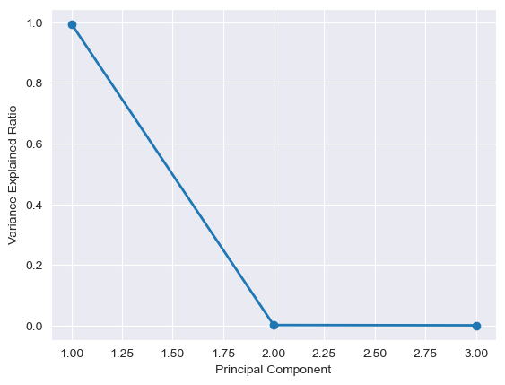

# 1. Introduction

Cricket is the most popular sport in the Indian subcontinent and the annual Indian Premier League (IPL) is one of its key events. Sports analysis remains a lucrative domain for professionals and hobbyists alike, evident in studies employing various ML methods across many sports tournaments with similar formats \[1\], \[2\].

Barot et al \[3\] analyze 4 years of IPL data to create a model that can predict the outcome of matches. The features extracted are team performance, location (home/away) and other external factors affecting a match. Another study \[1\] performs a binary classification to predict whether a team will make the NBA playoffs based on the performance in the regular season, using 25 years of match statistics.

# 2. Problem Definition

The goals of this project are two-fold: 
* Firstly, we propose to **predict the likelihood of teams qualifying for the IPL playoffs**. We plan to train a supervised learning model, with the most discriminative features extracted from the dataset, to predict chances of each team advancing to the IPL playoffs. 
* Secondly, we propose to **group players in various contract categories based on their performance**. There are five possible player contract categories (Grade-A+, Grade-A, Grade-B, Grade-C, Non-Contracted), which directly influences the players bidding amount.  We propose to use an unsupervised clustering algorithm to tackle this problem.

# 3. Data Collection

The data was sourced from: 
[Kaggle dataset for IPL from 2008-2022](https://www.kaggle.com/datasets/vora1011/ipl-2008-to-2021-all-match-dataset)

### 3.1 Playoff Prediction

`Matches` data from 2008-2022 IPL seasons dataset was used as a source which consists of data about every single match played in this period. Each row corresponds to a unique match. 

|   ID       |   City    |   Date        |   Season  |   MatchNumber  |   Team1                |   Team2             |   Venue                      |   TossWinner           |   TossDecision  |   SuperOver  |   WinningTeam       |   WonBy    |   Margin  |   method  |   Player_of_Match  |   Team1Players                                                                                                                                                      |   Team2Players                                                                                                                                             |   Umpire1      |   Umpire2        |
|------------|-----------|---------------|-----------|----------------|------------------------|---------------------|------------------------------|------------------------|-----------------|--------------|---------------------|------------|-----------|-----------|--------------------|---------------------------------------------------------------------------------------------------------------------------------------------------------------------|------------------------------------------------------------------------------------------------------------------------------------------------------------|----------------|------------------|
|   1304114  |   Mumbai  |   2022-05-20  |   2022    |   68           |   Chennai Super Kings  |   Rajasthan Royals  |   Brabourne Stadium, Mumbai  |   Chennai Super Kings  |   bat           |   N          |   Rajasthan Royals  |   Wickets  |   5       |   NA      |   R Ashwin         |   ['RD Gaikwad', 'DP Conway', 'MM Ali', 'N Jagadeesan', 'AT Rayudu', 'MS Dhoni', 'MJ Santner', 'Simarjeet Singh', 'Mukesh Choudhary', 'PH Solanki', 'M Pathirana']  |   ['YBK Jaiswal', 'JC Buttler', 'SV Samson', 'D Padikkal', 'R Ashwin', 'SO Hetmyer', 'R Parag', 'TA Boult', 'YS Chahal', 'M Prasidh Krishna', 'OC McCoy']  |   CB Gaffaney  |   NA Patwardhan  |

Here is a description of the features and their relevance. The focus of this description is for our supervised learning task of predicting playoff teams.

1. `ID`: This is a unique match identifier
2. `City`, `Date` and `Season` of the match played
3. `MatchNumber`: This feature can range from 1-72 or have a value from the list ["Final", "Qualifier", "Qualifier 1", "Qualifier 2", "Eliminator", "Semi Final", "Elimination Final", "3rd Place Play-Off”] Group stage matches are the numbered ones, and the ones from the list are matches in the playoffs/knockout stages. Since we predict playoff qualification based on regular season performance, we only use the rows that have a numeric value for this feature
4. `Team1`, `Team2`: Team names of playing teams
5. `Venue`: Stadium where the match was played. The pitch properties of a venue may favor playing styles of some teams
6. `TossWinner`: Can be equal to Team1 or Team2 - the team that won the toss
7. `TossDecision`: Can be either ‘bat’ or ‘field’ - the decision made by the team that won the Toss
8. `SuperOver`: A special over played when the teams are tied. This feature is a boolean value indicating whether the match was decided in a tie breaking over
9. `WinningTeam`: The team that won - this is the label for our data
10. `WonBy`: Can be either ‘Wickets’ or ‘Runs’ based on how the winning team won the match 
11. `Margin`: Complements ‘WonBy’ - the numeric value corresponds to the winning margin. If ‘WonBy’ == ‘Runs’ and ‘Margin’ == 10, the WinningTeam won by 10 runs 
12. `Method`: Whether D/L (Duckworth-Lewis) was applied in case of cutting the match short due to inclement weather 
13. `Player_of_Match`: The player who won the player of the match award for good performance
14. `Team1Players`, `Team2Players`: The playing 11 squad in the match - a team typically consists of more than 11 players, so this value may differ for a team across matches
15. `Umpire1`, `Umpire2`: The names of the Umpires for the match

In addition to the features available from the Kaggle dataset, we construct 2 new features:
1. `Team1Mean`: Mean ‘Rating’ of the players in the ‘Team1Players’ feature value for this match
2. `Team2Mean`: Mean ‘Rating’ of the players in the ‘Team2Players’ feature value for this match

‘Rating’ here is sourced from [ICC Cricket data](https://www.icc-cricket.com/rankings/mens/player-rankings/t20i). We choose the T20I rating since the IPL is a T20 format tournament (20 overs in a match). 

More specifically, all unique player names are extracted from the primary dataset, and the latest T20 rating is then used if available. The ICC may not provide a rating for players who have played very few international matches, or if some prolific senior players only played the first couple of IPL seasons when the T20 format was fairly new. 

### 3.2 Player Contract Clustering

`Ball-by-ball` data from the 2008-2022 IPL seasons dataset was used as a source. This consists of data about every ball played in every match in this period. Each row corresponds to a unique play. Example: 

|   ID       |   innings  |   overs  |   ballnumber  |   batter       |   bowler          |   non-striker  |   extra_type  |   batsman_run  |   extras_run  |   total_run  |   non_boundary  |   isWicketDelivery  |   player_out  |   kind  |   fielders_involved  |   BattingTeam       |
|------------|------------|----------|---------------|----------------|-------------------|----------------|---------------|----------------|---------------|--------------|-----------------|---------------------|---------------|---------|----------------------|---------------------|
|   1312200  |   1        |   0      |   1           |   YBK Jaiswal  |   Mohammed Shami  |   JC Buttler   |   NA          |   0            |   0           |   0          |   0             |   0                 |   NA          |   NA    |   NA                 |   Rajasthan Royals  |

We only need a subset of the features for clustering on player performance. Here is how the dataset is used: 

1. Get active players: Filter dataset to get all players who participated in the 3 most recent seasons. This is done by referencing the match ID from the `Matches` dataset corresponding to the first match in 2020 and using it as a cutoff. 
2. Infer roles of players: The `Ball-by-ball` dataset has features `batter` and `bowler` which are used to infer roles of players 
3. Performance Features: Generate aggregate values for each player from the dataset for the following features
    1. Batsmen: [`matches_played`, `run_scored`, `catches_taken`, `strike_rate_bat`, `mom`]
    2. Bowlers: [`matches_played`, `wickets_taken`, `catches_taken`, `strike_rate_bowl`, `economy_rate`, `mom`]
    (Here `mom`means Man of the Match/Player of the Match)

This results in 1 file each corresponding to batsmen stats and bowler stats. 

# 4. Methods

### 4.1 Data Preprocessing and Preparation

#### Team Name Changes

Over the last 15 seasons of the IPL, if a team was renamed, we have chosen the latest team name throughout all seasons to preserve the history of stats.

Image Source: [Wikipedia](https://en.wikipedia.org/wiki/Indian_Premier_League#Teams)

- Delhi Daredevils renamed to Delhi Capitals across all seasons
- Kings Xi Punjab renamed to Punjab Kings across all seasons
- Deccan Chargers renamed to Sunrisers Hyderabad to account for the franchise change 

Additionally, typos in team names were fixed to keep names consistent.

#### Categorical Values 

Wherever possible, string values have been encoded into categorical values. This is useful when we use the chi-square test for feature selection. For example, there are 11 total cities where all the IPL matches have ever been played. The feature values for ‘City’ i.e. ‘Bangalore’, ‘Chennai’, ‘Delhi’ etc. are encoded as 0, 1, .. ,10

#### Missing Values 

- Missing ‘City’ values were populated based on the ‘Venue’ values. For example, the Venue 'Sharjah Cricket' Stadium is in City ‘Sharjah’.
- Missing ‘Rating’ values for players were imputed using the average player rating across all players to minimize bias
- Rows corresponding to incomplete/cancelled matches were dropped to remove complexity

#### Extra Features 

The names of the playing squads of both teams did not seem intuitively useful by themselves. Mean ratings of the playing 11 for both teams i.e. ‘Team1Mean’ and ‘Team2Mean’ are added to the dataset as mentioned in 3.1

#### Binarize Labels

Since ‘WinningTeam’ is either Team1’s name or Team2’s name, after converting to categorical data, the values are in the range 0-14. To binarize, the value of the label ‘WinningTeam’ is converted to 0 if it is equal to Team1’s value or 1 if it is equal to Team2’s value. This makes the classification task simpler.

### 4.2 Feature Selection and Dimensionality Reduction

#### Playoff Prediction: Feature Selection

Since the features do not have continuous numerical values, chi-square analysis with p-values was used to select the best features instead of using PCA to transform them. The p-values for each feature were plotted, and the features with the highest p-value were discarded. Traditionally, a threshold of `p <= 0.05` is used in the chi-square analysis. It is statistically concluded that features with a p-value greater than 0.05 do not affect the target variable (label) and thus can be dropped. Since each season had a slightly varying list of features that could be dropped, only the ones common to all seasons were picked. This was because the intention was to train all seasons (except the latest one which is test data) together.
 
Based on this analysis, candidate features to be dropped are ‘WonBy’ and ‘TossDecision’. As described in the data collection section, since ‘Margin’ depends on ‘WonBy’, it can also be dropped. P-value plots from some seasons:

 
 

This matrix is not ideal, therefore we tried a different strategy by performing forward selection and backward elimination techniques using pvalues from OLS regression model.

forward_selection_results:  `{'Team2', 'MatchNumber', 'Margin', 'Venue', 'Team1', 'City', 'WinningTeam', 'TossWinner', 'WonBy', 'TossDecision'}`
backward_elimination_results:  `{'MatchNumber', 'Margin', 'Team1', 'City', 'WinningTeam', 'SuperOver', 'TossWinner', 'Team2', 'TossDecision'}`
 
Both the techniques resulted in similar features to be selected except two, which are `Venue` and `SuperOver`.
 
After feature reduction, the included ones are: `{'Team2', 'MatchNumber','SuperOver', 'Venue', 'Team1', 'City', 'TossWinner', 'TossDecision', 'WonBy}`

#### Player Contract Clustering: PCA

As described in the data collection section, we have more than 2 features for both bowlers and batsmen performances. We performed PCA on the dataset to transform the features into a lower dimension (of 2 features) which would make visualization easier, and also maximise the variance for cleaner clustering.

In case of both the bowler and the batsmen stats, the plot for explained variance vs the number of principal components looks like this (n=3):

Almost all of the variance is captured by the first component. This indicates that the data could be highly structured and highly correlated. This makes sense since performance can often be collapsed into a single metric, and it is often a heuristic combination of the features we have used. We thus transform the features into the 2-D space described by the first 2 principal components. 

### 4.3 Supervised Learning
The strategy employed for training classifiers is as follows:
1. Use training data from seasons 2008-2021 for training (70 train - 30 validation) and 2022 for testing
2. Train a list of classifiers, and predict the outcome of each match in the 2022 season
3. Based on the results, rank each team in based on the match outcomes 
4. Observe if the top 4 ranked teams are the ones who made it into the playoffs 

Since the success of the classifiers cannot be mapped directly to the strategy of getting the top-ranked teams, the ML metrics are measured one step earlier, i.e. whether the match outcomes were predicted correctly. This is the focus of the results and evaluation. The models used are decision tree, Naive Bayes, SVM, LDA, KNN, and Logistic Regression.

### 4.4 Unsupervised Learning
1. Use data transformed using PCA for clustering
2. Set the number of clusters to 5, since the expectation is for 5 player contract categories
3. Run different clustering algorithm and visualize 

The clustering algorithms used are: KMeans, Agglomerative Clustering, DBSCAN, Birch and Affinity Propagation. 

# 5. Results

### 5.1 Supervised Learning Task
We trained 6 different supervised models, decision tree, Naive Bayes, SVM, LDA, KNN, and Logistic Regression and predicted the labels for the test data.
 
Before label binarizing, the highest accuracy we were able to achieve was 41% for decision trees.
 
After label binarizing, we were able to achieve significantly higher accuracy for Decision trees, Naive Bayes, LDA, and Logistic regression, with Logistic regression having the highest accuracy of 69.3%, closely followed by LDA with an accuracy of 68.5%.

#### Performance Improvement: Hyperparameter Tuning 

To improve performance, we looked into how individual models could be tuned to fit the data better. This tuning is tabulated below:

| Model        | Change                                                                                     | % Improvement in F1 Score |
|--------------|--------------------------------------------------------------------------------------------|---------------------------|
| KNN          | Number of neighbours n changed from 5 to 3                                                 | 6                         |
| SVM          | Kernel changed from rbf (radial) to linear and C changed from 1 to 0.3 (narrower margin)   | 12                        |
| DecisionTree | max_depth changed from default (inf) to 3                                                  | 3                         |

Finally, the performance for all algorithms is tabulated below:

| Model              | Accuracy | Precision | Recall   | F1       |
|--------------------|----------|-----------|----------|----------|
| KNN                | 0.486891 | 0.483895  | 0.442748 | 0.458498 |
| SVM                | 0.689139 | 0.619289  | 0.740458 | 0.700361 |
| LDA                | 0.692884 | 0.622682  | 0.740458 | 0.702899 |
| LogisticRegression | 0.692884 | 0.622682  | 0.740458 | 0.702899 |
| DecisionTree       | 0.674157 | 0.604568  | 0.793893 | 0.705085 |
| NaiveBayes         | 0.700375 | 0.63003   | 0.732824 | 0.705882 |

All algorithms except KNN have comparable performance. Taking SVM as reference, the kernel used for performance improvement is "linear". This means that the data is linearly separable, and this linear separability also explains why other algorithms like Decision Tree also perform similarly. However, this performance is not objectively good given the F1 score is below 0.8. We can draw a useful insight from Naive Bayes. The model assumes that the features are independent, which is not the case in our supervised learning dataset as seen in the data preprocessing steps. Even intuitively, there are attributes in our dataset which are correlated, for e.g. `Venue` and `City`. Intuitively we should not be considering ‘WonBy’, and ‘Margin’ as they are correlated too, e.g. it is more likely for `Margin` to have a higher numerical value when the value of `Margin` is "runs" instead of "wickets" since a team can only win by a maximum of 10 wickets whereas winning runs are unbounded. 

More complex models may be able to learn a better representation of the data.

Based on the match predictions by Naive Bayes, the teams that make it to the playoffs are: ## TODO

### 5.2 Unsupervised Learning Task 

For clustering, since we do not have the ground truth (labels), we cannot measure the efficiency of clustering. However, depending on the geometrical structure of clusters, we can define a few metrics to assess the clustering quality. We are using Davies-Bouldin index, Silhouette score/coefficient(SC), Calinski Harabasz(CH) Score to evaluate the performance of the different clustering algorithms.

#### Evaluation of batsmen clustering 

| Algorithm                     | Clusters | DB Index  | SC score | CH score  |
|-------------------------------|----------|-----------|----------|-----------|
| KMeans                        | 4        | 0.449464  | 0.787841 | 3128.7980 |
| Agglomerative Clustering      | 5        | 0.457173  | 0.773726 | 2859.1770 |
| DBSCAN                        | 7        | 1.036026  | 0.152591 | 38.5098   |
| Birch.                        | 5        | 0.457173  | 0.773726 | 2859.1770 |

#### Evaluation of bowlers clustering 
| Algorithm                     | Clusters | DB Index  | SC score   | CH score  |
|-------------------------------|----------|-----------|------------|-----------|
| KMeans                        | 4        | 0.442359  | 0.698910   | 2290.5074 |
| Agglomerative Clustering      | 5        | 0.482044  | 0.662284   | 2357.9518 |
| DBSCAN                        | 6        | 0.994321  | -0.16371   | 22.7747   |
| Birch.                        | 5        | 0.482044  | 0.662284   | 2357.9518 |

Davies Bouldin Index is a way to assess clustering performance. DB Index defines similarity as ratio of average dispersion of two clusters to the separation between their centroids. Two clusters having a very high similarity would have a very high dispersion and would be situated very closely. Such clusters ideally should have been merged. A good clustering would have the DB Index as low as possible. This implies a good clustering should have tight clusters with high distance between the centroids. Ideally the DB index should be close to 0.

If we analyze the results -  KMeans, Agglomerative and Birch have almost the same DB Index while DBSCAN has significantly higher. This is due to the fact KMeans, Agglomerative and Birch focuses on distance between points for clustering which results in having lower scatter within the cluster compared to DBSCAN which works on connectivity which also happens to have lower inter-cluster distance.

# 6. References

1. Ma, Nigel. "NBA Playoff Prediction Using Several Machine Learning Methods." 2021 3rd International Conference on Machine Learning, Big Data and Business Intelligence (MLBDBI). IEEE, 2021.
2. Yaseen, Aliaa Saad, Ali Fadhil Marhoon, and Sarmad Asaad Saleem. "Multimodal Machine Learning for Major League Baseball Playoff Prediction." Informatica 46.6 (2022).
3. H. Barot, A. Kothari, P. Bide, B. Ahir and R. Kankaria, "Analysis and Prediction for the Indian Premier League," 2020 International Conference for Emerging Technology (INCET), 2020, pp. 1-7, doi: 10.1109/INCET49848.2020.9153972.
4. Garg, M (2016). Indian Premier League (Cricket), Version 5. Retrieved October 5, 2022 from [https://www.kaggle.com/datasets/manasgarg/ipl](https://www.kaggle.com/datasets/manasgarg/ipl) 
5. [https://www.kaggle.com/datasets/vora1011/ipl-2008-to-2021-all-match-dataset](https://www.kaggle.com/datasets/vora1011/ipl-2008-to-2021-all-match-dataset)
6. Vora, S (2022). IPL 2008 to 2022 All Match Dataset, Version 3. Retrieved October 5, 2022 from [https://www.kaggle.com/datasets/vora1011/ipl-2008-to-2021-all-match-dataset](https://www.kaggle.com/datasets/vora1011/ipl-2008-to-2021-all-match-dataset) 
7. A. Santra, A. Sinha, P. Saha and A. K. Das, "A Novel Regression based Technique for Batsman Evaluation in the Indian Premier League," 2020 IEEE 1st International Conference for Convergence in Engineering (ICCE), 2020, pp. 379-384, doi: 10.1109/ICCE50343.2020.9290569.

# 7. Timeline

[Proposal Gantt Chart](https://gtvault-my.sharepoint.com/:x:/g/personal/aahmad76_gatech_edu/EfJHL54BzxdHmGAvUFpSutEBRh1W31hwYXEF7K1zWbO71g?e=bq55hx)

# 8. Contribution

| Team Member | Overall Contribution                                                                                                                                                                                                 |
|------------------------|----------------------------------------------------------------------------------------------------------------------------------------------------------------------------------------------------------------------------------------------------------------------------------|
| Anam Ahmad  | • Additional data sourcing: player ratings   • Data cleaning, feature selection and corresponding report sections   • Preliminary classifier evaluation for further feature transformation |
| Amola Singh | • Additional data sourcing: player ratings   • Data cleaning, team data preprocessing, and updating Github page   • Evaluate preliminary classifier using various metrics |
| Rohith Sudheer| • Additional data sourcing: player ratings    • Data cleaning and filling missing data. Generating playoff labels    • Preliminary feature reduction |                                                                             
| Bodhisatwa Chatterjee| • Additional data sourcing: player ratings   •  Training different classifier models - coding and implementation |
| Vidhi Talera |  • Additional data sourcing: player ratings, player grades   • Feature reduction using forward and backward feature selection    • Evaluate preliminary classifiers on various metrics. Updating report sections and github page |

# Video Presentation

[Proposal Video](https://tinyurl.com/7641group2proposal)
[Final Video] (todo)

